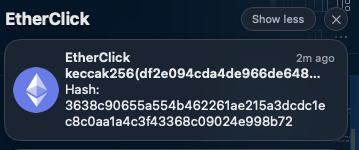

<p align="center">
  
</p>

# EtherClick
macOS MenuBar app for quick Ethereum-related operations on clipboard content

## Available Operations
 - Etherscan: Open an address in [Etherscan](https://etherscan.io/)
 - keccak256: Get the keccak256 hash of the clipboard's content

## Examples
The app is running as a menu bar icon:


Getting a hash:


If the clipboard does not contain an address (currently only verifies `clipboard[:2] == '0x'`) the app will send a notification:


## Building

To build the app, use py2app and the setup.py file:

```bash
python setup.py py2app
```

## Credits

The icon was taken from [here](https://iconarchive.com/show/cryptocurrency-flat-icons-by-cjdowner/Ethereum-ETH-icon.html).

This app was developed by following [this tutorial](https://camillovisini.com/article/create-macos-menu-bar-app-pomodoro/).
